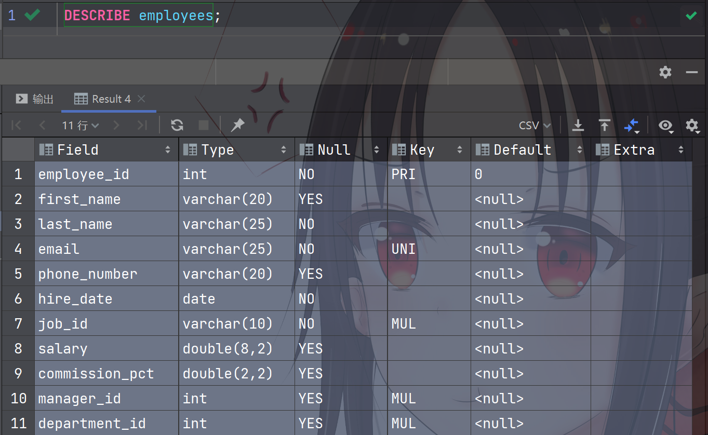

# Chapter3 基本的select语句

## 1. SQL的分类

### 1.1 DDL数据定义语言

DDL：Data Definition Languages

CREATE \ ALTER \ DROP（删除结构） \ RENAME \ TRUNCATE（清空）

### 1.2 DML数据操作语言

DML：Data Manipulation Language

INSERT \ DELETE（删除一条记录） \ UPDATE \ `SELECT（DQL：Data Query Language）`

### 1.3 DCL数据控制语言 

DCL：Data Control Language

`COMMIT（提交） \ ROLLBACK（回滚到上一次提交）(TCL：Transaction Control Language)` \ SAVEPOINT（可以回滚到保存点） \ GRANT（给予权限）\ REVOKE（收回权限）

## 2. SQL语言的规则与规范

### 2.1 SQL语言的规则 — 必须遵守

- SQL可以写在一行或多行。为了提高可读性，各个子句分开写，必要时使用缩进
- 每条命令以 ; 或 \g 或 \G 结束
- 关键字不能被缩写也不能分行
- 关于标点符号
  - 必须保证所有的 () 、单引号、双引号是成对结束的
  - 必须使用英文状态下的半角输入方式
  - 字符串型和日期时间类型的数据可以使用单引号（' '）表示
  - 列的别名，尽量使用双引号（" "），而且不建议省略as

### 2.2 SQL的规范 — 建议遵守

- MySQL在Windows环境下是大小写不敏感的
- MySQL在Linux环境下是大小写敏感的
  - 数据库名、表名、表的别名、变量名是严格区分大小写的
  - 关键字、函数名、列名（字段名）、列的别名（字段的别名）是忽略大小写的
- 推荐采用统一的书写规范
  - 数据库名、表名、表别名、字段名、字段别名等都是小写
  - SQL关键字、函数名、绑定变量等都大写

### 2.3 注释

```sql
单行注释：#注释文字(MySQL特有的方式)
单行注释：-- 注释文字(--后面必须包含一个空格。)
多行注释：/* 注释文字 */
```

### 2.4 命名规则

- 数据库、表名不得超过30个字符，变量名限制为29个

- 必须只能包含A-Z，a-z，0-9，共63个字符

- 数据库名、表名、字段名等对象名中间不要包含空格

- 同一个MySQL软件中，数据库不能同名

  同一个库中，表不能重名

  同一个表中，字段不能重名

- 必须保证你的字段没有和保留字、数据库系统或常用方法冲突。如果坚持使用，请在SQL语句中使用`（着重号）引起来

- 保持字段名和类型的一致性，在命名字段并且为制定数据类型的时候一定要保证一致性。假如数据类型在一个表里是整数，那在另一个表里可就编程字符型了

### 2.5 数据导入指令

在命令行客户端登录mysql，使用source指令导入

```shell
mysql> source d:\mysqldb.sql
```

通过FOREIGN_KEY_CHECKS解决，用法如下

```sql
set FOREIGN_KEY_CHECKS=0;  #在导入前设置为不检查外键约束
set FOREIGN_KEY_CHECKS=1;  #在导入后恢复检查外键约束
```

## 3. 基本的 SELECT 语句

### 3.1 SELECT ... FROM ...

- 语法

  ```sql
  SELECT 标识选择哪些列
  FROM 标识从哪个表中选择
  ```

- 选择全部列

  ```sql
  SELECT *
  FROM departments;
  ```

- 选择特定的列

  ```sql
  SELECT department_id, location_id
  FROM departments;
  ```

### 3.2 列的别名

- 重命名一个列

- 便于计算

- 紧跟列名，也可以在列名和别名之间加入关键字AS，别名使用双引号，以便在别名中包含空格或特殊的字符并区分大小写

- AS可以省略

- 建议别名简短，见名知意

  举例

  ```sql
  SELECT last_name AS name, commission_pct comm
  FROM employees;
  ```

### 3.3 去除重复行

`DISTINCT关键字`

```sql
SELECT DISTINCT department_id FROM employees;
```

### 3.4 空值参与运算

空值：null ( 不等同于0,  ’ ‘,  ’null‘ )

实际问题的解决方案：引入IFNULL

```sql
SELECT employee_id, salary "月工资", salary * (1 + IFNULL(commission_pct, 0)) * 12 "年工资" FROM employees;
```

这里你一定要注意，在 MySQL 里面， 空值不等于空字符串。一个空字符串的长度是 0，而一个空值的长 度是空。而且，在 MySQL 里面，空值是占用空间的。

### 3.5 着重号 ``

必须保证你的字段没有和保留字、数据库系统或常见方法冲突。

如果坚持使用，在SQL语句中使用 \` ` 引起来。

```sql
SELECT * FROM `order`;
```

### 3.6 查询常数

```sql
SELECT '小张科技' as "公司名", employee_id, last_name FROM employees;
```

## 4. 显示表结构

显示表中字段的详细信息

`DESCRIBE employees;`或`DESC employees;`

```shell
mysql> desc employees;
+----------------+-------------+------+-----+---------+-------+
| Field          | Type        | Null | Key | Default | Extra |
+----------------+-------------+------+-----+---------+-------+
| employee_id    | int(6)      | NO   | PRI | 0       |       |
| first_name     | varchar(20) | YES  |     | NULL    |       |
| last_name      | varchar(25) | NO   |     | NULL    |       |
| email          | varchar(25) | NO   | UNI | NULL    |       |
| phone_number   | varchar(20) | YES  |     | NULL    |       |
| hire_date      | date        | NO   |     | NULL    |       |
| job_id         | varchar(10) | NO   | MUL | NULL    |       |
| salary         | double(8,2) | YES  |     | NULL    |       |
| commission_pct | double(2,2) | YES  |     | NULL    |       |
| manager_id     | int(6)      | YES  | MUL | NULL    |       |
| department_id  | int(4)      | YES  | MUL | NULL    |       |
+----------------+-------------+------+-----+---------+-------+
```



其中，各个字段的含义分别解释如下：

- Field：表示字段名称。
- Type：表示字段类型，这里 barcode、goodsname 是文本型的，price 是整数类型的。
- Null：表示该列是否可以存储NULL值。
- Key：表示该列是否已编制索引。
- PRI表示该列是表主键的一部分；
- UNI表示该列是UNIQUE索引的一部分；
- MUL表示在列中某个给定值允许出现多次。
- Default：表示该列是否有默认值，如果有，那么值是多少。
- Extra：表示可以获取的与给定列有关的附加信息，例如AUTO_INCREMENT等。

## 5. 过滤数据

- 语法

  ```sql
  SELECT 字段1,字段2
  FROM 表名
  WHERE 过滤条件
  ```

  

使用WHERE 子句，将不满足条件的行过滤掉。WHERE子句紧随 FROM子句。

- 举例

  ```sql
  SELECT employee_id, last_name, job_id, department_id
  FROM employees
  WHERE department_id = 90;
  ```

  


