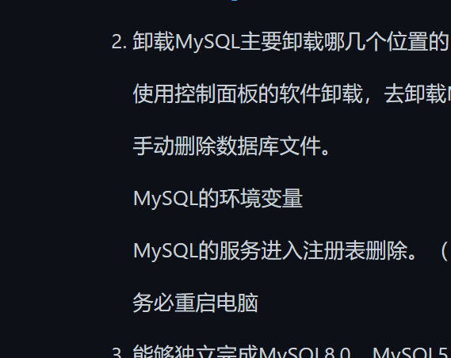

# Chapter2

1. 安装好MySQL之后在Windows系统中哪些位置能看到MySQL？

   - MySQL DBMS软件的安装位置。`D:\Downloads\MyApp\MySQL\8.0`

   - MySQL 数据库文件的存放位置。`D:\Documents\MySqlFiles\8.0\Data`

   - MySQL DBMS的配置文件。 `D:\Documents\MySqlFiles\8.0\my.ini`

   - MySQL的服务（想要通过客户端能够访问MySQL的服务器，必须保证服务是开启状态的）

     Win + x $\rightarrow$ g

     

   - MySQL的Path环境变量

     环境变量的打开方式：Win + x $\rightarrow$ y

     

2. 卸载MySQL主要卸载哪几个位置的内容？

   使用控制面板的软件卸载，去卸载MySQL DBMS软件的安装位置。

   手动删除数据库文件。

   MySQL的环境变量

   MySQL的服务进入注册表删除。（ regedit ）

   务必重启电脑

3. 能够独立完成MySQL8.0、MySQL5.7版本的下载、安装、配置 （**掌握**）

4. MySQL5.7配置完以后，如何修改配置文件？

- 为什么要修改my.ini文件？

  数据库默认使用的字符集是Latin，我们需要改为utf8

- 修改哪些信息？

  ```sql
  [mysql] #大概在63行左右，在其下添加
  ...
  default-character-set=utf8 #默认字符集
  [mysqld] # 大概在76行左右，在其下添加
  ...
  character-set-server=utf8
  collation-server=utf8_general_ci
  ```

  修改完以后需要重启服务

  ```shell
  net stop mysql服务名;
  
  net start mysql服务名;
  ```

5. 熟悉常用的数据库管理和操作的工具
   - 方式1：windows自带的cmd
   - 方式2：mysql数据库自带的命令行窗口
   - 方式3：图形化管理工具：Navicat、SQLyog、dbeaver等。




